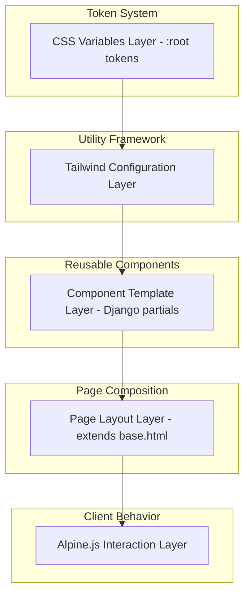
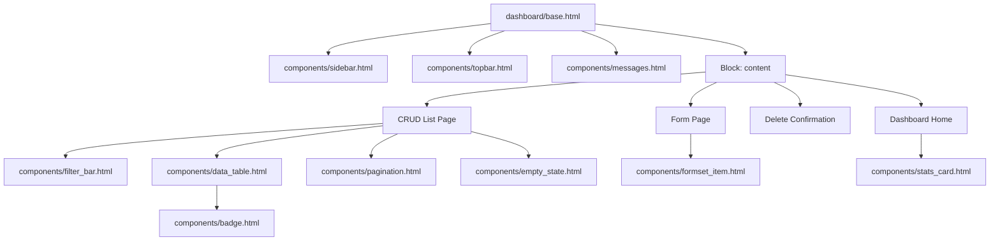

# Design Document: Dashboard Design System

## Overview

This design document defines the technical architecture for the Science Gates Custom Dashboard Design System. The system standardizes all UI components used across the dashboard — sidebar navigation, topbar, statistics cards, CRUD list pages, forms, data tables, filters, empty states, buttons, badges, pagination, notifications, and mobile behavior — into a cohesive, reusable component library.

The design system is built on the existing stack: Django Templates (partials via ``), Tailwind CSS with RTL plugin, Alpine.js for interactivity, and CSS custom properties for color tokens. It formalizes patterns already partially established in the codebase and introduces missing components to achieve full consistency.

**Key Design Decisions:**
- **CSS Variables for all semantic colors** — enables theme changes from a single `:root` declaration
- **Django template partials** — each component is an includable template with context variables
- **Tailwind utility-first** — no custom CSS classes except for CSS variable integration
- **Alpine.js for interactivity** — mobile sidebar toggle, notification dismissal, formset management
- **No JavaScript frameworks** — no React, Vue, or similar; Alpine.js handles all client-side state
- **RTL-first** — all components designed for Arabic RTL as the primary direction

## Architecture

The design system follows a layered architecture:



### Component Hierarchy



## Components and Interfaces

### 1. CSS Variable Token System (`static/css/dashboard.css`)

The `:root` selector defines all semantic color tokens consumed by Tailwind utilities and component templates.

```css
:root {
    /* Primary */
    --primary: #3b82f6;
    --primary-hover: #2563eb;
    
    /* Semantic */
    --secondary: #6b7280;
    --success: #10b981;
    --danger: #ef4444;
    --danger-hover: #dc2626;
    --warning: #f59e0b;
    --info: #3b82f6;
    
    /* Surfaces & Borders */
    --border: #e5e7eb;
    --bg-light: #f9fafb;
    --bg-dark: #1f2937;
    
    /* Text */
    --text-primary: #111827;
    --text-secondary: #4b5563;
    --text-muted: #9ca3af;
    
    /* Interactive States */
    --focus-ring: #3b82f6;
    --disabled-opacity: 0.5;
}
```

**Tailwind Integration** — The `tailwind.config.js` extends colors to reference CSS variables:

```javascript
// tailwind.config.js extend.colors
colors: {
    primary: 'var(--primary)',
    'primary-hover': 'var(--primary-hover)',
    secondary: 'var(--secondary)',
    success: 'var(--success)',
    danger: 'var(--danger)',
    'danger-hover': 'var(--danger-hover)',
    warning: 'var(--warning)',
    info: 'var(--info)',
    border: 'var(--border)',
    'bg-light': 'var(--bg-light)',
    'bg-dark': 'var(--bg-dark)',
    'text-primary': 'var(--text-primary)',
    'text-secondary': 'var(--text-secondary)',
    'text-muted': 'var(--text-muted)',
}
```

### 2. Dashboard Shell (`dashboard/base.html`)

**Interface (template context):**
| Variable | Type | Required | Description |
|----------|------|----------|-------------|
| `page_title` | string | Yes | Current page title (block) |
| `page_description` | string | No | Subtitle text (block) |
| `page_actions` | block | No | Action buttons HTML |
| `messages` | list | Auto | Django messages framework |
| `user` | User | Auto | Authenticated user object |

**Layout Structure:**
```
┌─────────────────────────────────────────────────────┐
│                    Viewport                          │
│  ┌──────────┬──────────────────────────────────┐    │
│  │          │  Topbar (page_title + actions)   │    │
│  │          ├──────────────────────────────────┤    │
│  │ Sidebar  │  Messages (if any)              │    │
│  │ (right   ├──────────────────────────────────┤    │
│  │  in RTL) │                                  │    │
│  │          │  Content Area (scrollable)       │    │
│  │  fixed   │                                  │    │
│  │  256px   │                                  │    │
│  │          │                                  │    │
│  └──────────┴──────────────────────────────────┘    │
└─────────────────────────────────────────────────────┘
```

**Alpine.js State (mobile):**
```javascript
x-data="{ sidebarOpen: false }"
```

### 3. Sidebar Component (`dashboard/components/sidebar.html`)

**Interface:**
| Variable | Type | Required | Description |
|----------|------|----------|-------------|
| `user` | User | Yes | Current authenticated user |
| `user.profile` | Profile | Yes | User profile with role permissions |
| `request.path` | string | Auto | Current URL for active state matching |

**Behavior:**
- Fixed position, 256px width on desktop (≥768px)
- Hidden on mobile, slides in as overlay when toggled
- Active nav item highlighted via URL path matching
- Sections hidden based on user permissions
- Keyboard navigable with visible focus indicators

### 4. Topbar Component (`dashboard/components/topbar.html`)

**Interface:**
| Variable | Type | Required | Description |
|----------|------|----------|-------------|
| `page_title` | string | Yes | Page heading text |
| `page_description` | string | No | Subtitle/description |
| `page_actions` | HTML | No | Action buttons block |

**Structure:** Flex row (RTL) — title+description on right, actions on left. Stacks vertically below 768px.

### 5. Statistics Card (`dashboard/components/stats_card.html`)

**Interface:**
| Variable | Type | Required | Description |
|----------|------|----------|-------------|
| `label` | string | Yes | Metric description (max 50 chars) |
| `value` | string/int | Yes | Metric value (max 7 digits or 10 chars) |
| `icon_svg` | string | No | SVG path for icon |
| `color` | string | No | CSS variable name for category border/icon bg |

### 6. Data Table (`dashboard/components/data_table.html`)

**Interface:**
| Variable | Type | Required | Description |
|----------|------|----------|-------------|
| `columns` | list[dict] | Yes | Column definitions: `{label, key, type}` |
| `rows` | QuerySet | Yes | Data rows |
| `edit_url_name` | string | Yes | URL name for edit action |
| `delete_url_name` | string | Yes | URL name for delete action |

**Column types:** `text`, `link`, `badge`, `date`, `actions`

### 7. Filter Bar (`dashboard/components/filter_bar.html`)

**Interface:**
| Variable | Type | Required | Description |
|----------|------|----------|-------------|
| `search_placeholder` | string | Yes | Search input placeholder |
| `filters` | list[dict] | No | Dropdown filters: `{name, label, options, selected}` |
| `search_value` | string | No | Current search query |

### 8. Pagination (`dashboard/components/pagination.html`)

**Interface:**
| Variable | Type | Required | Description |
|----------|------|----------|-------------|
| `page_obj` | Page | Yes | Django paginator page object |
| `query_params` | string | No | Preserved filter query string |

### 9. Empty State (`dashboard/components/empty_state.html`)

**Interface:**
| Variable | Type | Required | Description |
|----------|------|----------|-------------|
| `icon_svg` | string | No | SVG path for illustration |
| `heading` | string | Yes | Empty state title (Arabic) |
| `description` | string | Yes | Suggested action text (max 120 chars) |
| `action_url` | string | No | CTA button URL |
| `action_label` | string | No | CTA button text |

### 10. Button Component (CSS classes, not a template)

**Variants (applied via Tailwind classes):**

| Variant | Classes |
|---------|---------|
| Primary | `bg-primary text-white hover:bg-primary-hover` |
| Secondary | `bg-gray-100 text-gray-800 hover:bg-gray-200` |
| Danger | `bg-danger text-white hover:bg-danger-hover` |
| Ghost | `bg-transparent text-primary hover:bg-gray-100` |
| Disabled | `opacity-50 pointer-events-none` |

**Base classes (all buttons):** `px-4 py-2 rounded-lg font-medium transition-colors duration-200 cursor-pointer`

### 11. Badge Component (`dashboard/components/badge.html`)

**Interface:**
| Variable | Type | Required | Description |
|----------|------|----------|-------------|
| `text` | string | Yes | Badge label text |
| `variant` | string | Yes | Color variant: green, gray, blue, yellow, red |

**Status Mapping:**
| Status Value | Variant | Label |
|-------------|---------|-------|
| published | green | منشور |
| unpublished | gray | غير منشور |
| new | yellow | جديد |
| contacted | blue | تم التواصل |
| read | gray | مقروء |
| unread | yellow | غير مقروء |
| urgent | red | عاجل |

### 12. Notification Messages (`dashboard/components/messages.html`)

**Interface:**
| Variable | Type | Required | Description |
|----------|------|----------|-------------|
| `messages` | list | Yes | Django messages framework messages |

**Alpine.js behavior:** Each message has `x-data="{ show: true }"` with dismiss button setting `show = false`.

**ARIA roles:** `role="alert"` for error/warning, `role="status"` for success/info.

### 13. Form Page Layout

**Interface (blocks in page template):**
| Block | Description |
|-------|-------------|
| `form_sections` | Form field groups |
| `form_actions` | Submit + cancel buttons |

**Constraints:** `max-w-4xl` width, sticky submit area, validation error display below inputs.

### 14. Delete Confirmation Page

**Interface:**
| Variable | Type | Required | Description |
|----------|------|----------|-------------|
| `item_name` | string | Yes | Name of item being deleted (truncated at 100 chars) |
| `cancel_url` | string | Yes | URL to return to list page |
| `delete_url` | string | Yes | Form action URL for deletion |

## Data Models

This design system does not introduce new database models. It operates on the presentation layer only, consuming existing Django model data through template context variables.

**Existing models consumed by components:**
- `User` + `UserProfile` — sidebar permissions, user display
- `Article`, `University`, `Institute`, `Major` — CRUD list/form pages
- `Lead` — messages section, unread count badge
- `Redirect` — SEO section list page
- Django `messages` framework — notification display

**Template Context Pattern:**
```python
# View provides context to template
context = {
    'page_title': 'المقالات',
    'page_description': 'إدارة جميع المقالات والأخبار',
    'items': Article.objects.all(),
    'search_query': request.GET.get('search', ''),
    'filters': [...],
}
```

## Correctness Properties

*A property is a characteristic or behavior that should hold true across all valid executions of a system-essentially, a formal statement about what the system should do. Properties serve as the bridge between human-readable specifications and machine-verifiable correctness guarantees.*

### Property 1: Not Applicable — UI Rendering System

*For any* UI design system component consisting of CSS variable tokens, Django template partials, Tailwind CSS utility classes, and Alpine.js interactive behaviors, property-based testing does not apply because there are no pure functions with meaningful input variation, no serialization logic, no parsers, and no algorithmic transformations. Correctness is verified through template rendering tests, CSS variable consistency checks, accessibility audits, responsive behavior verification, and visual regression snapshots.

**Validates: Requirements 1.1, 1.2, 1.3, 1.4, 1.5, 1.6**

## Error Handling

### Form Validation Errors
- Django form validation errors are rendered below the corresponding input field
- Error styling: red border (`border-red-500`) on input + red text (`text-sm text-red-500`) below with `mt-1`
- On validation failure, all entered data is preserved and the page scrolls to the first error
- Non-field errors display at the top of the form in a danger-styled notification

### Empty States
- When a queryset returns zero results, the empty state component replaces the data table
- When filters return no results, the filter bar remains visible with current values, and a filtered empty state message appears

### Permission Errors
- Sidebar sections are hidden entirely when the user lacks permission (no error shown)
- Direct URL access to unauthorized pages is handled by Django's permission decorators (returns 403)

### Notification Messages
- Django messages framework handles success/error/warning/info feedback
- Messages are dismissible via Alpine.js without page reload
- Messages stack vertically with 8px gap when multiple exist

## Testing Strategy

### Why Property-Based Testing Does Not Apply

This feature is a **UI rendering and layout** design system. It defines:
- CSS variable color tokens (declarative configuration)
- Django template partials (HTML rendering)
- Tailwind CSS utility class patterns (styling)
- Alpine.js interactive behaviors (client-side state)

There are no pure functions with meaningful input/output variation. The components render HTML based on template context — this is best validated through snapshot tests, visual regression, and example-based integration tests.

### Testing Approach

**1. Django Template Rendering Tests (Unit)**
- Verify each component template renders correct HTML structure given context variables
- Test conditional rendering (permission-based sidebar sections, empty states vs data tables)
- Test active state highlighting in sidebar based on `request.path`
- Test badge variant mapping for each status value
- Test pagination link generation with preserved query parameters
- Test form error display with validation errors in context

**2. CSS Variable Integration Tests (Unit)**
- Verify all CSS variables are defined in `:root`
- Verify no hardcoded hex/rgb values in component templates (grep-based)
- Verify Tailwind config references CSS variables correctly

**3. Accessibility Tests (Unit/Integration)**
- Verify semantic HTML structure (table elements with scope attributes)
- Verify ARIA roles on notification messages (alert vs status)
- Verify `aria-hidden="true"` on decorative icons
- Verify `aria-label` on icon-only buttons
- Verify focus indicators on interactive elements
- Verify contrast ratios meet WCAG 4.5:1 for normal text, 3:1 for large text

**4. Responsive Behavior Tests (Integration)**
- Verify sidebar hidden on mobile viewport
- Verify mobile menu toggle functionality (Alpine.js)
- Verify grid column changes at breakpoints (1→2→4 for stats cards)
- Verify table horizontal scroll on narrow viewports
- Verify filter bar stacking on mobile

**5. RTL Layout Tests (Visual/Integration)**
- Verify sidebar positioned on right side
- Verify text alignment is right-aligned
- Verify icon margins use `ml-` (margin-left in RTL = margin on start side)
- Verify border directions (left border on sidebar in RTL)

**6. Visual Regression Tests**
- Snapshot each component in default, hover, focus, active, disabled states
- Compare against baseline screenshots at mobile, tablet, desktop breakpoints
- Verify flat colors (no gradients) across all surfaces

### Test Tools
- **Django TestCase** — template rendering with `assertContains`, `assertTemplateUsed`
- **pytest-django** — parameterized tests for badge mappings, permission combinations
- **Playwright or Selenium** — responsive behavior, Alpine.js interactions
- **axe-core** — automated accessibility audits
- **Percy or Chromatic** — visual regression snapshots

### Test Coverage Priorities
1. Component rendering with correct context (high priority)
2. Permission-based visibility (high priority)
3. Accessibility compliance (high priority)
4. Responsive breakpoint behavior (medium priority)
5. Visual consistency (medium priority — visual regression)
6. Alpine.js interactions (medium priority — mobile toggle, dismiss)
