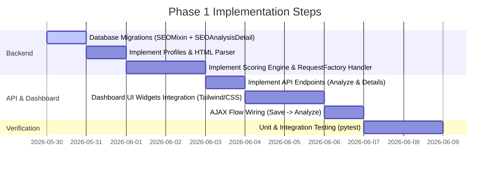

# Final Page SEO Analyzer Implementation Plan — Phase 1

This document outlines the final, production-ready architecture and step-by-step implementation roadmap for building the Final Page SEO Analyzer in the Science Gates portal.

---

## 1. Executive Summary & Design Decisions

### A. Preview URL + RequestFactory (SSRF & Deadlock Prevention)
* **The Architecture**: We define a logical preview URL path for content (e.g., `/articles/<slug>/?preview=token`). 
* **The Internal Fetch**: Instead of calling the URL over HTTP using the `requests` library (which causes a **deadlock** on Django's single-threaded local development server and introduces latency/firewall issues in production), the backend uses `django.test.RequestFactory` to simulate the request in-memory.
* **Execution**: The path is resolved dynamically via Django's URL resolver (`resolve(path)`), and the view's `.as_view()` is dispatched synchronously. This is 100% thread-safe, fast, and does not require an active HTTP port.

### B. User Flow: Auto-Save Draft First
To prevent analyzing stale database content:
1. When the editor clicks the "Analyze SEO" button in the dashboard, the frontend serialize the current form state.
2. It sends an AJAX request to save the page content as a **draft** (e.g. `publish_status='unpublished'`).
3. Once the database is successfully updated, the frontend triggers the `/dashboard/seo/analyze/` API.
4. The analyzer reads the fresh draft state directly from the database through the in-memory rendering engine.

### C. Split Database Storage (Keeping Core Tables Light)
To optimize performance, prevent table bloat, and avoid N+1 querying:
* **Lightweight SEO Summary (added directly to `SEOMixin`)**:
  - `seo_score` (IntegerField)
  - `seo_grade` (CharField)
  - `seo_last_analysis` (DateTimeField)
  - `seo_critical_count` (IntegerField)
  - `seo_warning_count` (IntegerField)
* **Heavy Audit Detail (separate model `SEOAnalysisDetail` in `apps.seo.models`)**:
  - Contains a `GenericForeignKey` to the content object.
  - Contains a large `analysis_report_json` (JSONField) storing detailed list of passes, warnings, missing image alts, heading tree, and schema structures.
  - The JSON is loaded via AJAX **only** when the user opens the SEO Analyzer slide-out/widget on the dashboard.

### D. Cache Strategy & Manual Force Re-analysis
* **Cache Check**: When rendering the edit form, the dashboard checks if `updated_at` (last saved time) is less than or equal to `seo_last_analysis`. If true, the system skips analysis and loads the cached score instantly.
* **Manual Override**: The "Analyze SEO" button bypasses this check, forcing a fresh save-draft and re-analysis.

### E. Unified Content Selector Strategy
After inspecting all four real templates, the confirmed HTML structure across **all content types** is:
```
div.detail-page-container
  ├── div.detail-header                        ← hero / banner (EXCLUDED)
  ├── div.detail-layout
  │     ├── div[data-seo-content]             ← main content — TARGETED by single selector
  │     └── div.detail-sidebar                ← lead form + quick facts (EXCLUDED automatically)
  └── div[data-seo-ignore].detail-related      ← related articles grid (EXCLUDED)
```
**Strategy**: Add a single `data-seo-content` HTML attribute to the correct element in each template. All profiles inherit `content_selector = '[data-seo-content]'` from `BaseSEOProfile`. The placement decision lives in the template, not in Python:
* **Articles** (`templates/articles/detail.html` L74): place on `div.detail-section-content.article-content` — isolates only the written body, excludes tags.
* **Universities** (`templates/universities/detail.html` L61): place on `div.detail-main` — covers all sections (description, admission, faculties, FAQ).
* **Institutes** (`templates/institutes/detail.html` L59): place on `div.detail-main`.
* **Majors** (`templates/majors/detail.html` L59): place on `div.detail-main`.
* All `div.detail-related` sections gain `data-seo-ignore` to exclude related article card text from word counts.

---

## 2. Technical Map & New Models

### A. Core SEOMixin Fields
We will update [apps/core/models.py](file:///c:/Users/MohYousif/Desktop/Sciences%20Gates/apps/core/models.py) to include these columns in the abstract `SEOMixin`:

```python
# In apps/core/models.py
class SEOMixin(models.Model):
    # (Existing SEO fields...)

    # Phase 1 Analyzer Fields
    seo_score = models.PositiveIntegerField(
        default=0,
        verbose_name='درجة SEO'
    )
    seo_grade = models.CharField(
        max_length=20,
        default='needs_improvement',
        verbose_name='تقييم SEO'
    )
    seo_critical_count = models.PositiveIntegerField(
        default=0,
        verbose_name='الأخطاء الحرجة'
    )
    seo_warning_count = models.PositiveIntegerField(
        default=0,
        verbose_name='التحذيرات'
    )
    seo_last_analysis = models.DateTimeField(
        null=True,
        blank=True,
        verbose_name='تاريخ آخر تحليل'
    )

    class Meta:
        abstract = True
```

### B. SEOAnalysisDetail Model
We will modify [apps/seo/models.py](file:///c:/Users/MohYousif/Desktop/Sciences%20Gates/apps/seo/models.py) to define the detailed audit table:

```python
# In apps/seo/models.py
from django.db import models
from django.contrib.contenttypes.models import ContentType
from django.contrib.contenttypes.fields import GenericForeignKey

class SEOAnalysisDetail(models.Model):
    """Stores heavy JSON audit logs decoupled from core content tables."""
    content_type = models.ForeignKey(ContentType, on_delete=models.CASCADE)
    object_id = models.PositiveIntegerField()
    content_object = GenericForeignKey('content_type', 'object_id')

    analysis_report_json = models.JSONField(
        default=dict,
        verbose_name='تقرير التحليل التفصيلي'
    )
    created_at = models.DateTimeField(auto_now_add=True)
    updated_at = models.DateTimeField(auto_now=True)

    class Meta:
        # unique_together guarantees exactly ONE analysis record per content object.
        # Without this, repeated analysis clicks create duplicate rows silently.
        unique_together = [('content_type', 'object_id')]
        indexes = [
            models.Index(fields=['content_type', 'object_id']),
        ]
        verbose_name = 'تفاصيل تحليل SEO'
        verbose_name_plural = 'تفاصيل تحليلات SEO'
```

---

## 3. Core Classes & Strategy Services

All service classes live in `apps/seo/services/`. The analyzer runs **three layers** of checks against different data sources.

```
Layer 1 ─ Full-Page Checks     ← entire rendered HTML (head + body)
Layer 2 ─ Main-Content Checks  ← inside [data-seo-content] only
Layer 3 ─ Model-Aware Checks   ← direct DB field inspection (no HTML)
```

### A. Content Profiles (`apps/seo/services/content_profiles.py`)

Profiles now define **SectionCompleteness** rules instead of heading-based topic matching.
Each rule validates three things: HTML section present, DB field non-empty, and minimum character count.

```python
class BaseSEOProfile:
    content_selector = '[data-seo-content]'  # unified — set via template attribute
    min_word_count = 300
    expected_schemas = []
    min_internal_links = 1
    # section_checks: list of {'key', 'label', 'min_chars', 'field_names': list[str]}
    # field_names are model attribute names checked directly on the content object (Layer 3)
    section_checks = []

class ArticleSEOProfile(BaseSEOProfile):
    # data-seo-content on div.article-content (articles/detail.html L74)
    min_word_count = 500
    expected_schemas = ['NewsArticle']
    min_internal_links = 2
    section_checks = [
        {'key': 'content', 'label': 'محتوى المقالة',
         'field_names': ['content'], 'min_chars': 300},
    ]

class UniversitySEOProfile(BaseSEOProfile):
    # data-seo-content on div.detail-main (universities/detail.html L61)
    min_word_count = 600
    expected_schemas = ['EducationalOrganization', 'FAQPage']
    min_internal_links = 3
    section_checks = [
        {'key': 'description', 'label': 'وصف الجامعة',
         'field_names': ['description'], 'min_chars': 150},
        # Checks if ANY of the three admission fields is non-empty (at least one level covered)
        {'key': 'admission', 'label': 'شروط القبول',
         'field_names': ['admission_requirements_bachelor',
                         'admission_requirements_master',
                         'admission_requirements_phd'],
         'min_chars': 100, 'require_any': True},
        # Checked via related model count (faculties.count() > 0)
        {'key': 'faculties', 'label': 'الكليات والبرامج',
         'field_names': ['faculties'], 'min_chars': 0, 'is_relation': True},
        {'key': 'faqs', 'label': 'الأسئلة الشائعة',
         'field_names': ['faqs'], 'min_chars': 0, 'is_relation': True},
    ]

class InstituteSEOProfile(BaseSEOProfile):
    # data-seo-content on div.detail-main (institutes/detail.html L59)
    min_word_count = 400
    expected_schemas = ['EducationalOrganization']
    min_internal_links = 2
    section_checks = [
        {'key': 'description', 'label': 'وصف المعهد',
         'field_names': ['description'], 'min_chars': 100},
        {'key': 'registration', 'label': 'شروط التسجيل',
         'field_names': ['registration_requirements'], 'min_chars': 80},
        {'key': 'courses', 'label': 'الدورات',
         'field_names': ['courses'], 'min_chars': 0, 'is_relation': True},
    ]

class MajorSEOProfile(BaseSEOProfile):
    # data-seo-content on div.detail-main (majors/detail.html L59)
    min_word_count = 300
    expected_schemas = ['FAQPage']
    min_internal_links = 2
    section_checks = [
        {'key': 'description', 'label': 'وصف التخصص',
         'field_names': ['description'], 'min_chars': 100},
        # At least one of these rich-text fields must be filled
        {'key': 'career', 'label': 'فرص العمل أو مجالات التخصص',
         'field_names': ['career_opportunities', 'why_study_section'],
         'min_chars': 80, 'require_any': True},
    ]
```

### B. HTML Parser (`apps/seo/services/html_parser.py`)

Split into three extraction methods matching the three check layers:

```python
from bs4 import BeautifulSoup
import json

class SEOHTMLParser:
    def __init__(self, html_content: str, profile: BaseSEOProfile):
        self.soup = BeautifulSoup(html_content, 'html.parser')
        self.profile = profile

    # --- Layer 1: Full-Page ---
    def extract_full_page_data(self) -> dict:
        """Extracts from the entire document: head tags, H1, lang, E-E-A-T signals."""
        return {
            # Meta
            'title': self.soup.title.string.strip() if self.soup.title else '',
            'meta_description': self._get_meta('description'),
            'canonical': self._get_canonical(),
            'robots': self._get_meta('robots'),
            'html_lang': self.soup.find('html').get('lang', '') if self.soup.find('html') else '',
            # H1 lives in div.detail-header, OUTSIDE [data-seo-content]
            'h1': self.soup.find('h1').get_text(strip=True) if self.soup.find('h1') else '',
            # OG
            'og_title': self._get_meta('og:title', attr='property'),
            'og_description': self._get_meta('og:description', attr='property'),
            'og_image': self._get_meta('og:image', attr='property'),
            # Schema JSON-LD (raw strings for validation)
            'schemas': self._extract_schemas(),
            # E-E-A-T signals
            'author_visible': bool(self.soup.find(attrs={'class': lambda c: c and 'author' in c})),
            'date_visible': bool(self.soup.find('time') or self.soup.find(attrs={'class': lambda c: c and 'date' in c})),
            'breadcrumb_present': bool(
                self.soup.find('nav', attrs={'aria-label': lambda l: l and 'breadcrumb' in l.lower()})
                or self.soup.find(attrs={'class': lambda c: c and 'breadcrumb' in c})
            ),
        }

    # --- Layer 2: Main-Content ---
    def extract_main_content_data(self) -> dict:
        """Extracts from [data-seo-content] scope only."""
        main = self.soup.select_one(self.profile.content_selector)
        if not main:
            return {'word_count': 0, 'headings': [], 'images': [], 'links': [],
                    'selector_missing': True}
        # Strip data-seo-ignore blocks
        for el in main.select('[data-seo-ignore]'):
            el.decompose()
        # Word count on clean text
        word_count = len(main.get_text(separator=' ').split())
        # Headings — H2 and below (H1 is outside this scope)
        headings = [{'level': int(h.name[1]), 'text': h.get_text(strip=True)}
                    for h in main.find_all(['h2', 'h3', 'h4'])]
        # Images
        images = [{'src': img.get('src', ''), 'alt': img.get('alt', '').strip()}
                  for img in main.find_all('img')]
        # Internal links (relative paths or same domain)
        links = [{'href': a.get('href', ''), 'text': a.get_text(strip=True)}
                 for a in main.find_all('a', href=True)]
        return {'word_count': word_count, 'headings': headings,
                'images': images, 'links': links, 'selector_missing': False}

    # --- Layer 1 Helpers ---
    def _get_meta(self, name, attr='name'):
        tag = self.soup.find('meta', {attr: name})
        return tag.get('content', '').strip() if tag else ''

    def _get_canonical(self):
        tag = self.soup.find('link', rel='canonical')
        return tag.get('href', '').strip() if tag else ''

    def _extract_schemas(self) -> list[dict]:
        """Parse all JSON-LD blocks. Returns list of validated schema objects."""
        results = []
        for script in self.soup.find_all('script', type='application/ld+json'):
            raw = script.string or ''
            try:
                obj = json.loads(raw)
                results.append({'raw': raw, 'parsed': obj, 'valid_json': True})
            except json.JSONDecodeError as e:
                results.append({'raw': raw, 'parsed': None, 'valid_json': False,
                                'error': str(e)})
        return results
```

### C. Schema Validator (`apps/seo/services/schema_validator.py`)

Real property-level validation for each expected schema type:

```python
class SchemaValidator:
    # Minimum required properties per @type
    REQUIRED_PROPS = {
        'EducationalOrganization': ['name', 'url'],
        'NewsArticle':             ['headline', 'datePublished', 'author'],
        'FAQPage':                 ['mainEntity'],
        'BreadcrumbList':          ['itemListElement'],
    }

    def validate_all(self, schemas: list[dict], expected_types: list[str]) -> dict:
        found_types, issues, passed = [], [], []

        for schema in schemas:
            if not schema['valid_json']:
                issues.append({'code': 'INVALID_SCHEMA_JSON',
                               'msg': f'JSON-LD غير صالح: {schema["error"]}'})
                continue
            obj = schema['parsed']
            schema_type = obj.get('@type', 'Unknown')
            found_types.append(schema_type)
            self._validate_required_props(obj, schema_type, issues, passed)
            if schema_type == 'FAQPage':
                self._validate_faq_entities(obj, issues, passed)

        for expected in expected_types:
            if expected not in found_types:
                issues.append({'code': f'MISSING_SCHEMA_{expected.upper()}',
                               'msg': f'نوع Schema مطلوب غير موجود: {expected}'})

        return {'found_types': found_types, 'issues': issues, 'passed': passed}

    def _validate_required_props(self, obj, schema_type, issues, passed):
        for prop in self.REQUIRED_PROPS.get(schema_type, []):
            if not obj.get(prop):
                issues.append({'code': f'SCHEMA_MISSING_PROP',
                               'msg': f'Schema {schema_type} يفتقد للخاصية: {prop}'})
            else:
                passed.append(f'{schema_type}.{prop} موجود')

    def _validate_faq_entities(self, obj, issues, passed):
        entities = obj.get('mainEntity', [])
        if not entities:
            issues.append({'code': 'FAQPAGE_EMPTY',
                           'msg': 'FAQPage.mainEntity فارغ — لا توجد أسئلة مربوطة'})
            return
        for i, entity in enumerate(entities):
            answer_text = entity.get('acceptedAnswer', {}).get('text', '')
            if not answer_text:
                issues.append({'code': 'FAQ_MISSING_ANSWER',
                               'msg': f'السؤال رقم {i+1} في FAQPage ليس له إجابة'})
            else:
                passed.append(f'FAQ سؤال {i+1} كامل')
```

### D. Scoring Engine — Weighted Categories (`apps/seo/services/scoring.py`)

Replaces arbitrary point deductions with **5 defensible weighted categories**.
Each category earns points from 0 to its max. The final score is the sum.

```
┌──────────────────────────────┬──────────┬────────────────────────────────────────────────────────────┐
│ Category               │ Max pts │ Sub-checks                                            │
├──────────────────────────────┼──────────┼────────────────────────────────────────────────────────────┤
│ Meta & Indexability    │   25    │ title(10), description(10), robots/canonical(5)       │
│ Content Completeness   │   25    │ word_count(10), section_checks per profile(15)        │
│ E-E-A-T Signals        │   20    │ H1(5), author/date(8), lang(4), breadcrumb(3)         │
│ Schema Quality         │   20    │ schema present(5), valid JSON(5), required props(10)  │
│ Media & Links          │   10    │ image alts(5), internal links(3), og_image(2)         │
└──────────────────────────────┴──────────┴────────────────────────────────────────────────────────────┘
```

**Grades**: 85–100 → `good` — 60–84 → `needs_improvement` — 0–59 → `critical`

**Scoring rule for each sub-check**:
- Full pass → full sub-points
- Partial (e.g., title exists but wrong length) → 50% of sub-points
- Fail → 0 points
- noindex detected → Meta & Indexability capped at 0 (critical override)

```python
class SEOScoringEngine:
    def __init__(self, full_page, main_content, model_checks,
                 schema_results, profile, content_obj):
        self.full_page = full_page
        self.main_content = main_content
        self.model_checks = model_checks   # dict from Layer 3
        self.schema_results = schema_results
        self.profile = profile
        self.content_obj = content_obj
        self.categories = {
            'meta_indexability': {'earned': 0, 'max': 25},
            'content_completeness': {'earned': 0, 'max': 25},
            'eeat_signals':       {'earned': 0, 'max': 20},
            'schema_quality':     {'earned': 0, 'max': 20},
            'media_links':        {'earned': 0, 'max': 10},
        }
        self.critical_issues = []
        self.warnings = []
        self.passed_checks = []

    def evaluate(self) -> dict:
        self._check_meta_indexability()    # Layer 1
        self._check_eeat_signals()         # Layer 1
        self._check_content_completeness() # Layer 2 + Layer 3
        self._check_schema_quality()       # Layer 1 (schema_results)
        self._check_media_links()          # Layer 2

        total = sum(c['earned'] for c in self.categories.values())
        if 'noindex' in self.full_page.get('robots', ''):
            self.categories['meta_indexability']['earned'] = 0
            self.critical_issues.append({
                'code': 'NOINDEX_SET',
                'msg': 'الصفحة مضبوطة على noindex — لن يفهرسها جوجل خالصاً.',
                'remediation': 'اتصل بمسؤول النظام لمراجعة إعدادات robots.'
            })
            total = sum(c['earned'] for c in self.categories.values())

        grade = 'good' if total >= 85 else ('needs_improvement' if total >= 60 else 'critical')
        return {
            'score': total,
            'grade': grade,
            'categories': self.categories,
            'critical_count': len(self.critical_issues),
            'warning_count':  len(self.warnings),
            'passed_count':   len(self.passed_checks),
            'critical_issues': self.critical_issues,
            'warnings':  self.warnings,
            'passed_checks': self.passed_checks,
        }
```

### E. Model-Aware Check Runner (`apps/seo/services/model_checks.py`)

Layer 3 runs directly against the Django model instance — no HTML parsing:

```python
class ModelAwareChecker:
    """Validates DB field content for each section defined in the profile."""

    def run(self, content_obj, profile: BaseSEOProfile) -> list[dict]:
        results = []
        for rule in profile.section_checks:
            results.append(self._check_rule(content_obj, rule))
        return results

    def _check_rule(self, obj, rule: dict) -> dict:
        key, label, min_chars = rule['key'], rule['label'], rule['min_chars']
        is_relation = rule.get('is_relation', False)
        require_any = rule.get('require_any', False)

        if is_relation:
            # Related manager: check .count() > 0
            mgr = getattr(obj, key, None)
            count = mgr.count() if mgr else 0
            if count == 0:
                return {'key': key, 'status': 'fail', 'label': label,
                        'msg': f'لا توجد سجلات مرتبطة لـ «{label}».'}
            return {'key': key, 'status': 'pass', 'label': label,
                    'msg': f'«{label}»: {count} سجلات.'}

        # Text fields
        field_values = [getattr(obj, f, '') or '' for f in rule['field_names']]
        if require_any:
            longest = max(field_values, key=len, default='')
            value = longest
        else:
            value = field_values[0] if field_values else ''

        stripped = value.strip()
        if not stripped:
            return {'key': key, 'status': 'fail', 'label': label,
                    'msg': f'«{label}» فارغ.'}
        if len(stripped) < min_chars:
            return {'key': key, 'status': 'warning', 'label': label,
                    'msg': f'«{label}» قصير جداً ({len(stripped)} حرف) — الحد الأدنى {min_chars} حرف.'}
        return {'key': key, 'status': 'pass', 'label': label,
                'msg': f'«{label}» مكتمل.'}
```

---

## 4. API Endpoints & Request Flow

We will add three clear JSON endpoints to `apps/dashboard/urls.py`:

### A. API Endpoints Map
1. **AJAX Save Draft**: `/dashboard/<content-type>/<pk>/edit/`
   - Modifies existing edit view. If header `X-Requested-With: XMLHttpRequest` is present, it returns JSON: `{"status": "success"}` on form validation success instead of redirecting.
2. **AJAX Analyze SEO**: `/dashboard/seo/analyze/<content-type>/<pk>/`
   - Simulates in-memory rendering, runs parsing/scoring, saves summary fields on the object, creates/updates `SEOAnalysisDetail`, and returns the lightweight score.
3. **AJAX Get SEO Details**: `/dashboard/seo/detail/<content-type>/<pk>/`
   - Returns the heavy analysis JSON log for the dashboard panel.

### B. Analyze SEO JSON Response Structure
```json
{
  "status": "success",
  "seo_score": 85,
  "seo_grade": "good",
  "seo_critical_count": 0,
  "seo_warning_count": 2,
  "seo_last_analysis": "2026-05-30T07:48:23"
}
```

### C. SEO Details JSON Response Structure
```json
{
  "status": "success",
  "score_summary": {
    "score": 85,
    "grade": "good",
    "critical_count": 0,
    "warning_count": 2,
    "passed_count": 12
  },
  "critical_issues": [],
  "warnings": [
    {
      "code": "BAD_TITLE_LENGTH",
      "msg": "طول العنوان (35 حرف) قصير جداً.",
      "remediation": "اجعل عنوان الصفحة بين 40 و 60 حرفاً لتفادي قطعه في نتائج بحث جوجل."
    },
    {
      "code": "MISSING_IMAGE_ALTS",
      "msg": "هناك صورتين تفتقر للنص البديل (Alt text).",
      "remediation": "أضف نصاً بدلياً واصفاً للصور لتحسين الفهرسة ومساعدة ذوي الاحتياجات الخاصة."
    }
  ],
  "heading_tree": [
    {"level": 1, "text": "دراسة الهندسة في جامعة ماليزيا"},
    {"level": 2, "text": "شروط القبول والتسجيل"},
    {"level": 3, "text": "الأوراق المطلوبة"}
  ],
  "serp_preview": {
    "title": "دراسة الهندسة في جامعة ماليزيا | بوابات العلوم",
    "description": "اكتشف شروط القبول والرسوم الدراسية لدراسة الهندسة في أفضل الجامعات الماليزية المعتمدة.",
    "url": "https://sciencesgates.com/universities/utm/"
  },
  "schema_status": {
    "detected_types": ["EducationalOrganization", "FAQPage"],
    "valid_json": true
  }
}
```

---

## 5. Step-by-Step Implementation Roadmap



### Step 1: Database Setup
- Add summary fields to `SEOMixin` in [apps/core/models.py](file:///c:/Users/MohYousif/Desktop/Sciences%20Gates/apps/core/models.py).
- Create `SEOAnalysisDetail` in [apps/seo/models.py](file:///c:/Users/MohYousif/Desktop/Sciences%20Gates/apps/seo/models.py).
  > **Note**: `apps/seo/models.py` currently contains only a placeholder import. The `SEOAnalysisDetail` model will be the first real model added to this file.
- Run `python manage.py makemigrations` and `python manage.py migrate`.

### Step 2: Service Layer Implementation
- Create directory `apps/seo/services/`.
- Add `__init__.py`, `content_profiles.py`, `html_parser.py`, `scoring.py`, and `page_analyzer.py`.
- Implement `RequestFactory` view dispatching logic inside `page_analyzer.py`.
- **Selector strategy**: `BaseSEOProfile.content_selector = '[data-seo-content]'` — one unified selector for all content types. Add the `data-seo-content` attribute to the correct wrapper in each detail template:
  - `templates/articles/detail.html` L74 → add to `div.detail-section-content.article-content`
  - `templates/universities/detail.html` L61 → add to `div.detail-main`
  - `templates/institutes/detail.html` L59 → add to `div.detail-main`
  - `templates/majors/detail.html` L59 → add to `div.detail-main`
- Add `data-seo-ignore` attribute to `div.detail-related` in all four detail templates to exclude related article card text from word counts.

### Step 3: API & Views Integration
- Create AJAX JSON views in `apps/seo/views.py`.
- Map view paths in `apps/dashboard/urls.py`.
- Implement draft/preview permission override in public detail views.

### Step 4: Dashboard Frontend Panel
- Create widget template `templates/dashboard/seo/analyzer_panel.html`.
- Incorporate this template inside model forms (e.g. `templates/dashboard/articles/form.html`).
- Add Alpine.js logic to fetch/save/render details in `static/js/seo_analyzer.js`.

---

## 6. Testing Checklist

- [ ] **Layer 1 — Full-Page Parser**:
  - H1 is found from `div.detail-header` (outside `[data-seo-content]`).
  - `html_lang` extracted correctly from `<html lang="...">` attribute.
  - Breadcrumb detected from `nav[aria-label]` and `.breadcrumb` class.
  - Author and date signals detected by class-based selectors.
  - All JSON-LD blocks are parsed; broken JSON is flagged with error detail.

- [ ] **Layer 2 — Main-Content Parser**:
  - `[data-seo-content]` not found → `selector_missing: true` returned, all content scores = 0.
  - `data-seo-ignore` blocks are stripped before word count calculation.
  - Heading extraction returns only H2/H3/H4 (H1 excluded from scope).
  - Image alt check correctly distinguishes decorative (empty alt) from missing alt.

- [ ] **Layer 3 — Model-Aware Checks**:
  - University with all three admission fields empty → `fail` on `admission` rule.
  - University with only `admission_requirements_bachelor` filled → `pass` (`require_any=True`).
  - University with zero faculties → `fail` on `faculties` relation rule.
  - University with 3 FAQs → `pass` on `faqs` relation rule.
  - Article with `content` field < 300 chars → `warning` on content rule.

- [ ] **Schema Validator**:
  - Broken JSON-LD string → `valid_json: false` with error message.
  - `EducationalOrganization` missing `url` property → `SCHEMA_MISSING_PROP` issue.
  - `FAQPage` with empty `mainEntity` → `FAQPAGE_EMPTY` critical issue.
  - `FAQPage` with an answer missing `text` → `FAQ_MISSING_ANSWER` issue.

- [ ] **Scoring Engine**:
  - noindex detected → `meta_indexability.earned = 0` regardless of title/desc quality.
  - All sub-checks passing → score = 100, grade = `good`.
  - Missing title + missing description → `meta_indexability.earned` capped, not negative.
  - Category breakdown in output matches actual sub-check results.

- [ ] **Integration Tests (RequestFactory)**:
  - In-memory rendering resolves correctly without calling network loopbacks.
  - Staff session context passed correctly — draft content is rendered.
  - `UniversityDetailView` renders draft (unpublished) when staff user is simulated.

- [ ] **UI/UX Walkthrough Tests**:
  - Clicking "Analyze SEO" auto-saves draft first, then triggers analysis.
  - `updated_at <= seo_last_analysis` serves cached score without re-analysis.
  - Score breakdown by category visible in the dashboard panel.
  - Section completeness table shows per-section pass/warning/fail status.

---

## 7. Acceptance Criteria

* **3-Layer Analysis**: The system runs Full-Page, Main-Content, and Model-Aware checks as distinct, independent layers.
* **H1 Correctly Scoped**: H1 is detected from the full document, not from `[data-seo-content]`, because H1 lives in `div.detail-header` across all templates.
* **Section Completeness**: Hardcoded section titles do NOT pass completeness checks — the actual DB field content is validated directly via the model instance.
* **Defensible Score**: Score is built from 5 weighted categories (Meta 25 + Content 25 + E-E-A-T 20 + Schema 20 + Media 10). Every point deduction traces to a named sub-check.
* **Real Schema Validation**: JSON-LD blocks are parsed, `@type` detected, required properties confirmed, and `FAQPage.mainEntity` structure validated.
* **E-E-A-T Phase 1**: `html lang`, author visibility, date visibility, and breadcrumb presence are checked and reported.
* **Split DB Storage**: Core tables store only score/grade summary. Heavy JSON stored in `SEOAnalysisDetail`, loaded via AJAX.
* **No Network Overhead**: Django `RequestFactory` used for in-memory rendering.
* **Arabic Remediation**: All issue messages and remediation text in standard Arabic.

---

## Pre-Implementation Fixes

The architecture remains unchanged (3-layer analyzer + split storage). The following fixes are mandatory before and during Phase 1 implementation.

### 1. Internal Request Context (RequestFactory)

When rendering preview/analyze HTML in-memory via `RequestFactory`, the simulated request MUST include:
- `request.user`
- session (when needed by middleware/view/template behavior)
- `HTTP_HOST`
- `secure=request.is_secure()` equivalent behavior

Implementation intent:
- Rendered HTML must be as close as possible to the real public/preview page.
- `request.build_absolute_uri()` must generate correct canonical/schema/OG absolute URLs.
- Add integration tests that fail if generated URLs use `testserver` or wrong protocol.

### 2. Draft Preview Permission (Phase 1 Scope)

Current detail views filter `publish_status='published'`; therefore a preview-aware mechanism is required.

Phase 1 authorization policy (simple by design):
- Draft preview access: `SuperAdmin` only.
- Analyze SEO endpoint access: `SuperAdmin` only.
- SEO detail endpoint access: `SuperAdmin` only.

Notes:
- Do NOT implement complex owner/editor permissions in Phase 1.
- Structure the permission checks so expansion to `ContentAdmin` / `SEOAdmin` is straightforward later.

### 3. SEO API Endpoints (Final Phase 1 Contract)

Define and implement these endpoints:
- `POST /dashboard/seo/analyze/<content_type>/<pk>/`
- `GET /dashboard/seo/detail/<content_type>/<pk>/`

Phase 1 security:
- Both endpoints are protected by SuperAdmin-only permission.

Required JSON error responses:
- unauthorized user
- invalid content type
- missing object
- failed draft rendering
- missing `[data-seo-content]`

### 4. UTF-8 Encoding Enforcement

Before coding, ensure UTF-8 correctness across all touched files.

Arabic remediation and UI text must render correctly in:
- Python source files
- Markdown plan
- JSON responses
- dashboard UI

All Mojibake/garbled Arabic must be fixed before implementation code is merged.

### 5. Database Constraint Modernization

In `SEOAnalysisDetail`, replace `unique_together` with a named modern constraint:

```python
models.UniqueConstraint(
    fields=["content_type", "object_id"],
    name="unique_seo_analysis_detail_per_object"
)
```

Keep the existing index on `content_type` and `object_id`.

### 6. Image Alt Validation Rules (Phase 1)

Refined rules:
- `alt` missing entirely => warning.
- `alt=""` is acceptable only if image is decorative and has either:
  - `aria-hidden="true"`, or
  - `role="presentation"`.
- Images inside `[data-seo-ignore]` are excluded from checks.
- Image issues are warnings (not critical errors).

### 7. Cache Strategy Note

Keep current Phase 1 cache policy:
- reuse cached analysis when `updated_at <= seo_last_analysis`.

Forward note:
- If frequent no-op saves cause repeated analysis pressure, consider adding `seo_content_hash` later.
- Do NOT implement hashing now unless it is trivial.

### 8. Final Approval Criteria (Ready for Phase 1)

This plan is approved for implementation only when all are true:
- Draft analysis works for SuperAdmin.
- RequestFactory rendering receives correct user/host/protocol context.
- H1 is detected from full-page layer.
- `[data-seo-content]` is used only for main-content checks.
- Model-aware section completeness works.
- Schema validation parses JSON-LD and validates expected fields.
- Heavy JSON is stored only in `SEOAnalysisDetail`.
- Core models store only lightweight SEO summary fields.
