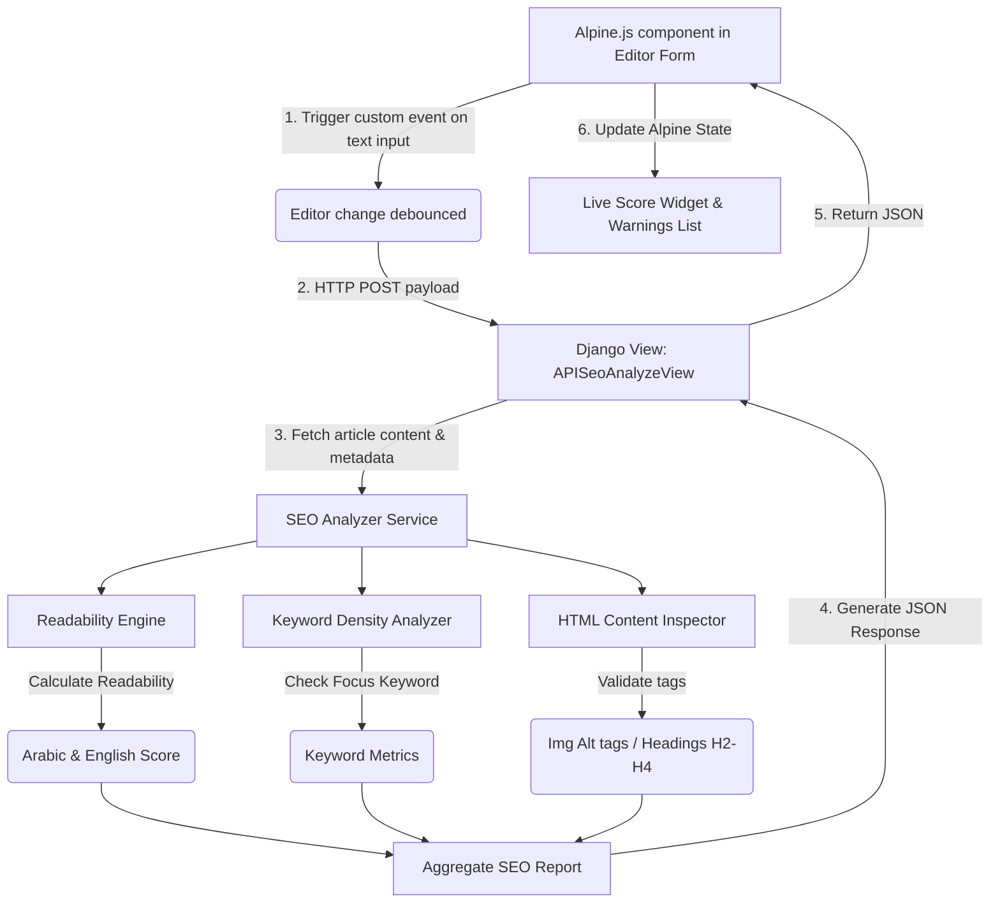

# PROJECT SEO EDITOR READINESS REPORT

This report evaluates the feasibility and readiness of the current Django project for integrating a live SEO assistant into the custom article editor. The goal is to provide a structured assessment of the backend, frontend, database, risks, and implementation map needed for a real-time, interactive SEO utility similar to Yoast or RankMath.

---

## 1. Project Overview

*   **Django Version**: **`4.2.11`** (LTS version, as defined in [requirements.txt](file:///C:/Users/MohYousif/Desktop/Sciences%20Gates/requirements.txt)).
*   **Main Apps**:
    *   `apps.articles`: Handles the article, category, and tag content logic.
    *   `apps.core`: Provides abstract base models, role-based definitions, and site settings.
    *   `apps.dashboard`: Controls the control panel views, urls, and forms.
    *   `apps.html_editor`: Implements the custom WYSIWYG editor widgets and sanitizers.
    *   `apps.seo`: Manages redirects, sitemaps, and Schema/JSON-LD structured data.
    *   Other apps in project: `institutes`, `leads`, `majors`, `redirects`, `search`, `universities`.
*   **Current Content-Related Models**:
    *   [Article](file:///C:/Users/MohYousif/Desktop/Sciences%20Gates/apps/articles/models.py#L80-L179): Main article content model. Inherits from `TimestampedModel`, `PublishableModel`, and `SEOMixin`. It includes fields like `title`, `slug`, `content` (HTML block), and relationships to `Category`, `Tag`, `User` (author), and other content models (universities, institutes, majors).
    *   [Category](file:///C:/Users/MohYousif/Desktop/Sciences%20Gates/apps/articles/models.py#L13-L47): Categorization taxonomy.
    *   [Tag](file:///C:/Users/MohYousif/Desktop/Sciences%20Gates/apps/articles/models.py#L49-L78): Tagging taxonomy.
*   **Current Editor Implementation**:
    *   [CustomHTMLEditorWidget](file:///C:/Users/MohYousif/Desktop/Sciences%20Gates/apps/html_editor/widgets.py#L12-L79): A custom Django form widget mapping the content field to the `widgets/html_editor.html` template.
    *   [ProfessionalHTMLEditor](file:///C:/Users/MohYousif/Desktop/Sciences%20Gates/static/js/html_editor.js#L9): A client-side vanilla JavaScript class initializing a customizable WYSIWYG editor over contenteditable areas.
    *   [editor-form-integration.js](file:///C:/Users/MohYousif/Desktop/Sciences%20Gates/static/js/editor-form-integration.js): Client-side form sync script that periodically (every 3 seconds) and on submit copies the custom editor's inner HTML into the target Django field.
    *   [sanitizer.py](file:///C:/Users/MohYousif/Desktop/Sciences%20Gates/apps/html_editor/sanitizer.py): Uses `bleach==6.1.0` to clean the HTML input before saving to the database to prevent cross-site scripting (XSS).
*   **Current Frontend Stack**:
    *   CSS framework: **Tailwind CSS v3.4.19** (configured with RTL support via `tailwindcss-rtl` in [package.json](file:///C:/Users/MohYousif/Desktop/Sciences%20Gates/package.json)).
    *   JS utilities: **Alpine.js v3.13.3** (loaded with the collapse plugin via CDN in [base.html](file:///C:/Users/MohYousif/Desktop/Sciences%20Gates/templates/dashboard/base.html#L160-L163)).
    *   Fonts and Icons: Standard web-safe typography and local Font Awesome Pro (`static/css/font-awesome-pro.css`).
*   **Existing JavaScript Structure**:
    *   Independent vanilla JS modules compiled/minified through node configurations (`scripts/minify-js.js`). Custom code wraps modules in IIFE patterns (e.g., [editor-form-integration.js](file:///C:/Users/MohYousif/Desktop/Sciences%20Gates/static/js/editor-form-integration.js)).
*   **Existing API/AJAX Patterns**:
    *   Fetch API with `X-CSRFToken` request headers. For example, AJAX tag creation in [form.html](file:///C:/Users/MohYousif/Desktop/Sciences%20Gates/templates/dashboard/articles/form.html#L580-L635) posts to `/dashboard/tags/create/?json=1` and handles JSON responses.
*   **Existing Authentication/Permission Structure**:
    *   Dashboard authorization mixes [mixins.py](file:///C:/Users/MohYousif/Desktop/Sciences%20Gates/apps/dashboard/mixins.py) class permissions. Editors run under `ContentAdminRequiredMixin` (checks `is_content_admin` or `is_super_admin`). Only users with the designated profile roles can create or update articles.

---

## 2. Current Editor Assessment

| Feature | Assessment | Coded/Implemented In |
| :--- | :--- | :--- |
| **Custom text editor** | Yes (WYSIWYG) | [html_editor.js](file:///C:/Users/MohYousif/Desktop/Sciences%20Gates/static/js/html_editor.js) |
| **Rich text editor** | Yes (Formatting tools, alignments, lists) | [html_editor.js](file:///C:/Users/MohYousif/Desktop/Sciences%20Gates/static/js/html_editor.js) |
| **Markdown editor** | No (Direct Rich HTML) | *Not applicable* |
| **HTML content field** | Yes | `content` in [models.py](file:///C:/Users/MohYousif/Desktop/Sciences%20Gates/apps/articles/models.py#L126) |
| **Image upload support** | Yes (Drag-and-drop / select dialog upload) | [views.py](file:///C:/Users/MohYousif/Desktop/Sciences%20Gates/apps/dashboard/views.py#L3135) & [image-upload.js](file:///C:/Users/MohYousif/Desktop/Sciences%20Gates/static/js/image-upload.js) |
| **Slug generation** | Manual but customizable | `slug` field in `ArticleForm` |
| **SEO title field** | Yes | `meta_title` in `SEOMixin` |
| **Meta description field** | Yes | `meta_description` in `SEOMixin` |
| **Focus keyword field** | Yes | `focus_keyword` in `SEOMixin` |
| **Canonical URL field** | Yes | `canonical_url` in `SEOMixin` |
| **Open Graph fields** | Yes | `og_title`, `og_description`, `og_image` in `SEOMixin` |
| **Schema/JSON-LD support** | Yes (Base generator templates exist) | [schema.py](file:///C:/Users/MohYousif/Desktop/Sciences%20Gates/apps/seo/schema.py) |
| **Draft/published workflow** | Yes (`published` / `unpublished`) | `publish_status` in `PublishableModel` |
| **Preview mode** | Partially (Public detail view link, no draft preview) | [form.html](file:///C:/Users/MohYousif/Desktop/Sciences%20Gates/templates/dashboard/articles/form.html#L201-L209) |

---

## 3. Django Backend Readiness

*   **`/api/seo-analyze/` Endpoint**: Ready to implement. A new view class or function can be added, mapping JSON payloads to an SEO analysis utility.
*   **JSON Request/Response**: Fully supported. Standard Django `JsonResponse` handles outgoing evaluation dictionaries.
*   **Debounced Live Analysis from Alpine.js**: Supported. The backend can instantly process requests sent by Alpine.js.
*   **Background Processing**: If heavy analysis (e.g. AI-based) is required on every save/check, the application does not have a task queue (like Celery/Redis) in [requirements.txt](file:///C:/Users/MohYousif/Desktop/Sciences%20Gates/requirements.txt). Thus, analysis must be synchronous and highly optimized (under 200ms) to prevent editor lag.
*   **Per-Article SEO Scoring**: Not yet saved in the DB. While [SEOOverviewView](file:///C:/Users/MohYousif/Desktop/Sciences%20Gates/apps/dashboard/views.py#L2921) calculates a dynamic *completion* score, it only counts filled metadata fields and is not stored. A dedicated scoring algorithm assessing content complexity and keyword usage is missing.
*   **Saving SEO Scores in Database**: Not supported currently. Model changes are required to persist scores.
*   **Internal Link Suggestions**: Feasible. The backend can run optimized queries over the `Article` model, filtering titles/contents containing tags or keywords from the current document.
*   **Image Alt Text Validation**: Ready to implement. The backend can parse the submitted content HTML using `BeautifulSoup` or regex to verify that `` elements contain valid `alt` text.
*   **Readability Scoring**: Ready to implement. Readability indices (e.g. Flesch-Kincaid) can be computed. However, because standard packages target English text, a custom Arabic readability parsing service must be written for the Arabic context.
*   **Keyword/Entity Extraction**: Feasible. High-performance Python tokenizers can parse text and extract key phrases.
*   **AI Suggestion Integration**: Ready to implement. Integrations with AI APIs (e.g., Gemini) can be set up via Python standard HTTP libraries or SDKs.

---

## 4. Alpine.js / Frontend Readiness

*   **Alpine.js Installation**: Installed and active. Alpine is available in dashboard views through CDN integration in `base.html`.
*   **Location of Alpine Components**: Primarily inline within templates (e.g. the collapsible Advanced SEO panel under `<section x-data="{ showAdvanced: false }">` in `form.html`).
*   **Triggering `x-on:input.debounce` on WYSIWYG Editor**:
    *   *Challenge*: The custom `ProfessionalHTMLEditor` hides the native `<textarea>` and uses a `contenteditable` `div` inside `.pro-editor-content`.
    *   *Solution*: The Javascript class in [html_editor.js](file:///C:/Users/MohYousif/Desktop/Sciences%20Gates/static/js/html_editor.js) must be updated to dispatch a custom DOM Event (e.g. `editor-change`) to the outer container when an edit occurs. Alpine.js can then capture it reactive-style via `@editor-change.debounce.1000ms="analyze()"` on the form wrapper.
*   **CSRF Handling**: Supported. Standard CSRF tokens are stored on forms (``) and read from DOM.
*   **Live Score UI**: Easily integratable. A dynamic score indicator can be placed in the right sidebar in [form.html](file:///C:/Users/MohYousif/Desktop/Sciences%20Gates/templates/dashboard/articles/form.html) next to the "Publish" button.
*   **SERP Preview Component**: Ready to implement. An Alpine component can bind inputs from `meta_title`, `meta_description`, and `slug` to display a live search snippet simulation.
*   **SEO Warnings update without Page Reload**: Supported. Alpine's reactive state (e.g. an array of `warnings` updated via the Fetch API response) can toggle list rendering dynamically.

---

## 5. Database Gap Analysis

The project uses [SEOMixin](file:///C:/Users/MohYousif/Desktop/Sciences%20Gates/apps/core/models.py#L61-L160) to share common fields. To build a fully-functional live SEO editor, several metrics must be persisted:

| Field Name | Needed? | Recommended Field Type | target Mixin / Model | Purpose |
| :--- | :---: | :--- | :--- | :--- |
| **`seo_title`** | No | `models.CharField` | `SEOMixin` | Replaced by existing `meta_title` |
| **`meta_description`** | No | `models.TextField` | `SEOMixin` | Already exists |
| **`focus_keyword`** | No | `models.CharField` | `SEOMixin` | Already exists |
| **`canonical_url`** | No | `models.URLField` | `SEOMixin` | Already exists |
| **`og_title`** | No | `models.CharField` | `SEOMixin` | Already exists |
| **`og_description`** | No | `models.TextField` | `SEOMixin` | Already exists |
| **`og_image`** | No | `models.ImageField` | `SEOMixin` | Already exists |
| **`seo_score`** | Yes | `models.PositiveIntegerField(default=0)` | `SEOMixin` | Stores the final calculated content SEO score |
| **`readability_score`** | Yes | `models.PositiveIntegerField(default=0)` | `SEOMixin` | Stores the readability readability index |
| **`content_score`** | Yes | `models.PositiveIntegerField(default=0)` | `SEOMixin` | Stores overall page content quality score |
| **`schema_type`** | Yes | `models.CharField(max_length=50, default='Article')` | `SEOMixin` | Specifies custom page schema configuration |
| **`generated_schema_json`** | Yes | `models.JSONField(null=True, blank=True)` | `SEOMixin` | Stores cached static JSON-LD markup |
| **`suggested_internal_links`** | Yes | `models.JSONField(null=True, blank=True)` | `SEOMixin` | Caches contextual internal links for this article |
| **`ai_suggestions`** | Yes | `models.JSONField(null=True, blank=True)` | `SEOMixin` | Stores AI generated optimization suggestions |
| **`last_seo_analysis_at`** | Yes | `models.DateTimeField(null=True, blank=True)` | `SEOMixin` | Tracks when the page SEO statistics were last saved |

---

## 6. Recommended SEO Analysis Architecture

### Key Components

1.  **Custom SEO Scoring Engine**:
    *   Checks if the focus keyword exists in the `meta_title`, `meta_description`, H1/H2 headings, first paragraph, and slug.
    *   Calculates keyword density (target range: 1% to 2.5%).
    *   Validates HTML layout rules (word count > 300, presence of heading tags H2/H3, link distributions).
2.  **Readability Engine (`services/readability.py`)**:
    *   Do not rely solely on `textstat` as it lacks robust support for Arabic grammatical syntax.
    *   Develop a custom parser counting average sentence length, syllable lengths, and complex Arabic words to output an adapted readability score.
3.  **Keyword/Entity Extraction (`services/keyword_extractor.py`)**:
    *   Avoid heavy packages like `KeyBERT` or `YAKE` on production servers. Instead, utilize a pure-Python TF-IDF variant or token frequency analysis optimized for performance.
4.  **AI Suggestion Integration (Optional)**:
    *   Add a backend client wrapper targeting the Google Gemini API. Let users request AI optimizations on demand rather than automatically calling the API on every keystroke.
5.  **PageSpeed Auditing**:
    *   Do not run live PageSpeed audits during typing. Keep execution restricted to a manual check triggered post-publication.

---

## 7. File-Level Implementation Map

To implement the live SEO editor assistant, the following files should be created or modified:

### Backend Services & Models (Core Logic)
1.  **[MODIFY] [models.py](file:///C:/Users/MohYousif/Desktop/Sciences%20Gates/apps/core/models.py)**:
    *   Update `SEOMixin` with new database columns (`seo_score`, `readability_score`, `generated_schema_json`, `last_seo_analysis_at`).
2.  **[NEW] [readability.py](file:///C:/Users/MohYousif/Desktop/Sciences%20Gates/apps/seo/services/readability.py)**:
    *   Write the bilingual readability algorithm (prioritizing Arabic prose structure rules).
3.  **[NEW] [keyword_extractor.py](file:///C:/Users/MohYousif/Desktop/Sciences%20Gates/apps/seo/services/keyword_extractor.py)**:
    *   Write the keyphrase frequency and density calculator.
4.  **[NEW] [seo_analyzer.py](file:///C:/Users/MohYousif/Desktop/Sciences%20Gates/apps/seo/services/seo_analyzer.py)**:
    *   Write the SEO analyzer orchestration module (aggregating readability, keyword check, and link validations).

### Dashboard Control Layer
5.  **[MODIFY] [urls.py](file:///C:/Users/MohYousif/Desktop/Sciences%20Gates/apps/dashboard/urls.py)**:
    *   Register API routes: `/dashboard/api/seo/analyze/` and `/dashboard/api/seo/save-score/`.
6.  **[MODIFY] [views.py](file:///C:/Users/MohYousif/Desktop/Sciences%20Gates/apps/dashboard/views.py)**:
    *   Create `SEOAnalyzeAPIView` to receive, clean, analyze, and return analysis results.
    *   Create `SEOSaveScoreAPIView` to store scores in the database asynchronously.
7.  **[MODIFY] [article.py](file:///C:/Users/MohYousif/Desktop/Sciences%20Gates/apps/dashboard/forms/article.py)**:
    *   Include new `SEOMixin` score fields if dashboard display is requested, or exclude them from manual forms to keep them automated.

### Frontend Layer
8.  **[MODIFY] [html_editor.js](file:///C:/Users/MohYousif/Desktop/Sciences%20Gates/static/js/html_editor.js)**:
    *   Modify `_syncToTextarea` in `ProfessionalHTMLEditor` to trigger a custom browser event `editor-change` on the editor container.
9.  **[NEW] [seo-editor.js](file:///C:/Users/MohYousif/Desktop/Sciences%20Gates/static/js/seo-editor.js)**:
    *   Develop the Alpine.js component logic coordinating the analysis endpoint requests and preview updates.
10. **[MODIFY] [form.html](file:///C:/Users/MohYousif/Desktop/Sciences%20Gates/templates/dashboard/articles/form.html)**:
    *   Wrap the editor section in the Alpine component: `x-data="seoEditor()"`.
    *   Add a sidebar panel displaying SEO warnings, readability score, and a live search snippet simulation.

---

## 8. Risk Assessment

*   **HTML Sanitization Conflicts**: The database already uses a signal (`sanitize_article_content`) linking `Bleach`. If our client-side analysis expects specific schema markup structures or elements in the editor that Bleach strips on the backend, discrepancies will occur. Sanitizer settings in [sanitizer.py](file:///C:/Users/MohYousif/Desktop/Sciences%20Gates/apps/html_editor/sanitizer.py) must align with the target SEO architecture.
*   **XSS Risks in Live Previews**: Displaying live previews (such as SERP or OG card titles/descriptions) requires escaping text. Ensure Alpine.js uses `x-text` instead of `x-html` when reflecting metadata inputs.
*   **Request Bloat / Server Latency**: Querying the database or parsing large documents on every keystroke will overload the server. Implement a strict debounce on Alpine.js (at least `1000ms`) and run processing logic concurrently or cache results.
*   **Lack of Draft Preview URL**: The current public view requires articles to have `publish_status='published'`. The editor does not support previewing draft articles using secure tokens, meaning authors must publish an article to preview its design.
*   **Database Migration Overhead**: Adding fields to `SEOMixin` will affect multiple database tables (`Article`, `University`, `Institute`, `Major`) because they all inherit from it. A clean migration sequence is vital.

---

## 9. Priority Roadmap

### Phase 1: Client-Side Metadata Audits & SERP Simulation
*   Implement the Alpine.js component wrapper in [form.html](file:///C:/Users/MohYousif/Desktop/Sciences%20Gates/templates/dashboard/articles/form.html).
*   Add a live, interactive Google Search snippet component showing title, slug, and descriptions dynamically updating.
*   Develop basic JavaScript checks verifying string length (e.g. warning if title > 60 chars or description > 160).

### Phase 2: Editor Integration & Custom Event Piping
*   Update [html_editor.js](file:///C:/Users/MohYousif/Desktop/Sciences%20Gates/static/js/html_editor.js) to dispatch custom events on input.
*   Bridge the custom editor to Alpine.js to allow live data flow.
*   Add the sidebar visual rating bar (Color coded: green, yellow, red).

### Phase 3: Live Scoring Endpoint & Readability Calculations
*   Develop the Django backend analysis API view.
*   Build the pure-Python bilingual readability and density algorithms.
*   Perform asynchronous validation checks (alt text, internal linking suggestion indexing).

### Phase 4: Database Migrations & Permanent Caching
*   Generate Django database migrations updating `SEOMixin` and existing tables.
*   Integrate backend score caching so lists reflect the current status in `SEOOverviewView`.

### Phase 5: On-Demand AI Assistant
*   Add a button inside the editor enabling authors to query Gemini for meta details or heading fixes.
*   Set strict user limits to prevent AI API key budget depletion.

---

## 10. Final Recommendation

### Direct Verdict: **Partially Ready**

#### Usable Elements Already Present:
1.  **Fully Coded SEO Mixin**: All core content models inherit from `SEOMixin`, providing metadata database fields (`meta_title`, `meta_description`, `focus_keyword`, `canonical_url`, etc.).
2.  **Modern Frontend Framework**: **Alpine.js** is already installed and loaded in the dashboard templates, making real-time DOM management simple.
3.  **Active WYSIWYG Editor Hook**: The editor uses a custom JavaScript file ([html_editor.js](file:///C:/Users/MohYousif/Desktop/Sciences%20Gates/static/js/html_editor.js)) that can easily be updated to dispatch data events.
4.  **Robust Cleaners**: The project already relies on `Bleach` to validate editor HTML output, reducing security vulnerabilities.

#### Essential Requirements to Address First:
1.  **Model Migrations**: Add score columns to `SEOMixin` to persist metric data.
2.  **JS Event Bridging**: Bind custom JS changes in the WYSIWYG contenteditable block to custom events so Alpine.js can monitor inputs.
3.  **Bilingual Readability Services**: Code custom Python modules to analyze Arabic sentence syntax.

*   **Estimated Complexity**: **Medium** (The frontend integration is relatively low-complexity because Alpine.js is already set up; backend algorithms for Arabic readability require careful validation).
