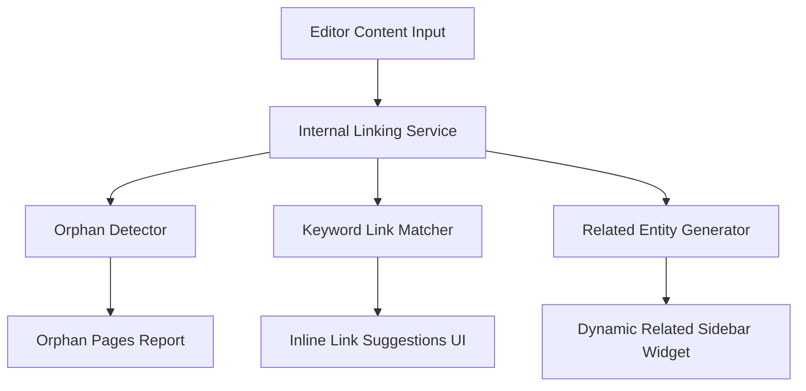

# SEO Phase 3 Implementation Plan: Mobile Polish & Content Relationship Engine

Following our architectural alignment, Phase 3 pivots away from low-ROI traditional SEO metrics (such as readability scores and exact keyword density counts) to focus on the highest-impact elements for user conversion, modern search crawlers, and database structure: **Mobile Responsiveness**, **Internal Linking Intelligence**, and a **Performance Audit**.

---

## 1. Core Objectives & Priorities

1.  **Mobile & RTL Polish (Priority: Critical / 5-Stars)**: Fix responsive layouts, RTL alignments, and dynamic interactive elements on mobile viewports.
2.  **Internal Linking Intelligence & Content Relationship Engine (Priority: High / 5-Stars)**: Connect Universities, Institutes, Majors, and Articles into a semantic content graph. Implement automated internal link suggestions and orphan page detection.
3.  **Performance Audit (Priority: High / 4-Stars)**: Run structured Lighthouse/Core Web Vitals audits to pinpoint exact rendering bottlenecks before executing optimization code (such as WebP conversion or fragment caching).
4.  **Deprioritized Metrics**: Postpone Readability calculations and Keyword Density checks. Modern search engine ranking models prioritize semantic coverage, user dwell time, and structural internal linking (Topical Silos) over keyword percentages.

---

## 2. Proposed Changes & Architecture



### Component A: Internal Linking Intelligence & Content Relationship Engine

#### [NEW] `apps/seo/services/relationship_engine.py`
Create a backend service orchestrating semantic relationships and internal linking opportunities:
1.  **Orphan Detector**:
    *   Scans fields (`content`, `description`, etc.) of all publishable models (`Article`, `University`, `Institute`, `Major`) using Django's ORM and regex/BeautifulSoup.
    *   Compiles a list of objects that have zero incoming internal links (i.e. links pointing to their `get_absolute_url()`).
2.  **Smart Link Opportunity Matcher**:
    *   Iterates through database object names/slugs (e.g. University names, Major names, Institute names).
    *   Runs a lightweight matching search over the text content of a draft.
    *   If a name is mentioned but is not already wrapped in a `<a>` tag, generate an opportunity record suggesting the exact range, string, and target redirect link.
3.  **Topical Silo & Related Content Generator**:
    *   Determines contextually related entities. For example, if a user is viewing a university in Selangor:
        *   Map institutes sharing the same `location` (Selangor).
        *   Map majors offered by its faculties.
        *   Map articles tagged with the university name or location.

#### [MODIFY] `apps/dashboard/views.py` & `apps/seo/views.py`
1.  Create `/dashboard/seo/relationship-report/` to render a report of Orphan Pages.
2.  Extend `dashboard_analyze_seo` (or create a dedicated AJAX endpoint) to return a list of JSON-formatted inline link opportunities:
    ```json
    {
      "status": "success",
      "link_opportunities": [
        {
          "text": "هندسة البرمجيات",
          "target_url": "/majors/software-engineering/",
          "suggestion": "أضف رابطاً داخلياً لتخصص هندسة البرمجيات"
        }
      ]
    }
    ```

#### [MODIFY] `static/js/seo-analyzer.js`
1.  Extend the SEO widget panel to display a new tab: **"بنية الروابط والعلاقات" (Link Structure & Relationships)**.
2.  Render detected orphan warnings and display inline link opportunities with a simple helper interface.

---

### Component B: Mobile Responsiveness & RTL Polish

#### [MODIFY] Static Styles (`static/css/`) & Form Templates
1.  **Responsive Table Wrap**: Wrap all dynamic database tables (`SubjectsTable`, `SalaryTable`, `CountriesTable`) in overflow-x containers (`overflow-x-auto`) to prevent layout breaking on mobile screens.
2.  **Alpine.js Accordion Fixes**: Ensure accordion items (`x-collapse` triggers) are optimized for touch interaction (increasing touch target to minimum 44x44px).
3.  **Form Alignment & Fields Layout**: Verify RTL text direction inside the dashboard edit forms for mobile browsers, ensuring buttons and inputs align nicely.

---

### Component C: Performance Auditing

#### [NEW] `scripts/performance_audit.py`
Write a Python script executing PageSpeed / Lighthouse automated audits over local/staging endpoints:
1.  Measures Largest Contentful Paint (LCP), Cumulative Layout Shift (CLS), and First Input Delay (FID).
2.  Locates blocking CSS/JS resources and lists image sizes causing layout shifts.
3.  Generates a structured performance baseline report to guide our optimization phase.

---

## 3. Verification Plan

### Automated Tests
*   **Orphan Detection Tests**: Assert that the orphan detector accurately identifies objects with zero incoming internal links and clears them from the report once a link is added.
*   **Link Suggestion Tests**: Provide content containing a university name and assert that the opportunity matcher returns the correct target URL and text suggestion.
*   **RTL & Mobile View Testing**: Execute browser validation (using Playwright or Selenium if available) validating that standard templates render cleanly on mobile viewport sizes (`375x812` and similar).

### Manual Verification
1.  Open the SEO panel on a draft article mentioning a registered university. Verify the "Link Opportunities" section suggests linking that university.
2.  Inspect the Orphan Pages dashboard tab and verify that a newly created, unlinked University immediately appears there.
3.  Inspect the universities and majors detail pages on a mobile emulator; confirm no horizontal scrollbars occur and accordions toggle correctly.
