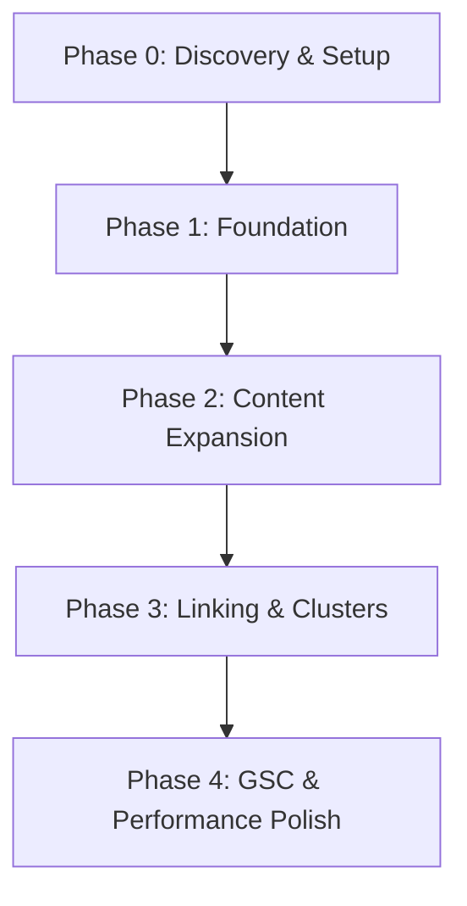

# Sciences Gates SEO - Master Strategy & Status Report

**Last Updated:** June 9, 2026  
**Status:** Phase 1 (Technical & Foundation) 100% Completed | Phase 2 (Content & Internal Links) Pending  
**Methodology:** Data-Driven Analysis & Holistic Optimization  

---

## 📖 Table of Contents

1. [Executive Summary](#-executive-summary)
2. [Quick Start Setup Guide](#-quick-start-setup-guide)
3. [Current System Audit & Gap Analysis](#-current-system-audit--gap-analysis)
4. [Master Implementation Status](#-master-implementation-status)
5. [Core SEO Strategy (Phased Roadmap)](#-core-seo-strategy-phased-roadmap)
6. [Content Guidelines & Specifications](#-content-guidelines--specifications)
7. [Site Structure & Internal Linking Strategy](#-site-structure--internal-linking-strategy)
8. [Advanced Optimization & KPIs](#-advanced-optimization--kpis)
9. [Decision-Making Framework](#-decision-making-framework)
10. [Reference Code Snippets](#-reference-code-snippets)

---

## 📊 Executive Summary

This master document serves as the single source of truth for the Search Engine Optimization (SEO) strategy and implementation status for the **Sciences Gates** platform (Study in Malaysia).

Historically, the project documentation was split across multiple files (`SEO_README.md`, `SEO_MISSING_ITEMS_REPORT.md`, `SEO_IMPLEMENTATION_STATUS.md`, and `QUICK_START_SEO.md`). To minimize documentation files and avoid redundancy as per the project rules, all these resources have been consolidated here.

### Summary of Accomplishments:
* **Technical Foundation:** 100% ready. GA4 and Google Search Console integrations are coded, and 7 dynamic JSON-LD Schema markup types are fully implemented.
* **Aesthetic & Dashboard Polish:** The dashboard SEO overview, detailed health reports, and settings have been redesigned to use custom SVG elements and the primary color system (`var(--primary)`).
* **Next Critical Step:** The main bottleneck is **content size (13 pages currently)** and **internal links**. The site needs to reach a "Critical Mass" of 30-40 universities and majors to establish Topical Authority.

---

## ⚡ Quick Start Setup Guide

Follow this guide to activate GA4, verify Google Search Console, and test SEO setups.

### Step 1: Set Up Google Analytics 4 (GA4)
1. Visit [Google Analytics](https://analytics.google.com/).
2. Create an account named `Science Gates` and a web property named `Science Gates Website`.
3. Set Time Zone to `Malaysia Time` (GMT+8) and Currency to `MYR`.
4. Create a Web Stream with URL `https://sciencesgates.com`.
5. Copy the generated **Measurement ID** (e.g., `G-ABC123XYZ`).

### Step 2: Set Up Google Search Console (GSC)
1. Visit [Google Search Console](https://search.google.com/search-console).
2. Add a property using the **URL prefix** option: `https://sciencesgates.com`.
3. Select the **HTML tag** verification method.
4. Copy the code value inside the `content="..."` attribute of the meta tag.

### Step 3: Configure Environment Variables
Open your [.env](file:///c:/Users/MohYousif/Desktop/Sciences%20Gates/.env) file at the project root and append:
```env
GA4_MEASUREMENT_ID=G-ABC123XYZ
GOOGLE_SITE_VERIFICATION=your_gsc_verification_code_here
```

### Step 4: Collect Static Assets & Run Server
Run the following commands in the PowerShell terminal:
```powershell
python manage.py collectstatic --noinput
python manage.py runserver
```

### Step 5: Verify the Setup
1. Open the website locally at `http://localhost:8000`.
2. Inspect the page source or press `F12` -> Network tab and search for `google-analytics` to confirm the GA4 tracking script is running.
3. Once the production deployment is complete, go back to GSC and click **Verify**.

---

## 🔍 Current System Audit & Gap Analysis

Based on an audit comparing our target SEO strategy against the active Django codebase, here is the status:

| Optimization Area | Coded/Implemented | Missing/Pending | Implementation Level |
| :--- | :--- | :--- | :--- |
| **GA4 & GSC Integration** | Yes (Context Processor & base.html) | Environment variable values | 95% |
| **Structured Data (Schema)** | Yes (7 Schema Types) | None | 100% |
| **robots.txt / crawler rules**| Yes (Static & Fallback View) | None | 100% |
| **Performance Basics (WebP)** | Yes (signals.py + utils.py) | None (pre-existing) | 100% |
| **Content Mass** | No | 30+ Universities, 30+ Majors, 20+ Pillar Articles | 5% |
| **Internal Linking** | Partially (Models exist) | Actual relations populated | 10% |
| **Hub / Category Pages** | Partially (ListViews exist) | Cross-linking context variables | 20% |

> [!IMPORTANT]  
> The site's technical foundation is complete, but its SEO ranking capability is blocked by **Content Depth**. 7 universities, 3 majors, and 3 articles are insufficient to compete in the Study Abroad niche.

---

## Master Implementation Status

### 1. Google Analytics 4 & Search Console
* **Files Modified:**
  * [base.py](file:///c:/Users/MohYousif/Desktop/Sciences%20Gates/config/settings/base.py) - Added config settings.
  * [context_processors.py](file:///c:/Users/MohYousif/Desktop/Sciences%20Gates/apps/core/context_processors.py) - Injected settings globally.
  * [base.html](file:///c:/Users/MohYousif/Desktop/Sciences%20Gates/templates/base.html) - Rendered meta tags and async gtag scripts.
* **Status:** Fully functional. Awaiting active production IDs in `.env`.

### 2. Structured Data (Schema Markup)
* **Files Created/Modified:**
  * [schema_tags.py](file:///c:/Users/MohYousif/Desktop/Sciences%20Gates/apps/seo/templatetags/schema_tags.py) - Template tag helpers.
  * [detail.html](file:///c:/Users/MohYousif/Desktop/Sciences%20Gates/templates/universities/detail.html) - University & FAQ schema.
  * [detail.html](file:///c:/Users/MohYousif/Desktop/Sciences%20Gates/templates/majors/detail.html) - Course schema.
  * [detail.html](file:///c:/Users/MohYousif/Desktop/Sciences%20Gates/templates/articles/detail.html) - Article schema.
* **Implemented Schema Types:**
  1. `Organization` (Global template fallback)
  2. `EducationalOrganization` (University detail pages)
  3. `Course` (Major detail pages)
  4. `Article` (Blog/articles pages)
  5. `BreadcrumbList` (All breadcrumbed pages)
  6. `FAQPage` (University pages with FAQs)
  7. `WebPage` (General pages)

### 3. Robots Exclusion Protocol (robots.txt)
* **Files Created:**
  * [robots.txt](file:///c:/Users/MohYousif/Desktop/Sciences%20Gates/static/robots.txt) - Optimized static configuration.
  * [views.py](file:///c:/Users/MohYousif/Desktop/Sciences%20Gates/apps/seo/views.py) - Added view fallback if static file fails to load.
* **Exclusions:** Blocks `/admin/`, `/dashboard/`, `/api/`, dynamic page queries, and limits AI aggregators (GPTBot, ChatGPT-User, CCBot, Anthropic-AI, Claude-Web).

### 4. Admin SEO Dashboard
* **Files Modified:**
  * [seo_management.html](file:///c:/Users/MohYousif/Desktop/Sciences%20Gates/templates/dashboard/seo_management.html) - Replaced FontAwesome dependencies with SVG icons, translated titles to Arabic, polished tables, and made rows clickable.
* **Status:** Complete.

---

## core-seo-strategy-phased-roadmap



### Phase 0: Discovery & Baseline (Immediate)
Before expanding the site, answer the 5 critical scoping questions:
1. **Total Page Target:** How many total university/specialization URLs will be migrated or created? (Target: 80-100+)
2. **Current Indexation:** Run `site:sciencesgates.com` on Google. Record the current indexed page count.
3. **GSC Analytics Baseline:** Access Search Console (if active) and record impressions/clicks for the last 90 days.
4. **Content Strategy Resources:** Will content be produced via professional writers, AI-assisted drafts with human review, or legacy migration?
5. **Quality Reviewer:** Who is responsible for reviewing and verifying the accuracy of fees and admission criteria?

### Phase 1: Foundation Activation (Week 1)
* Add production IDs for GA4 and GSC to `.env`.
* Deploy code changes and run `collectstatic`.
* Run Google Rich Results Test to confirm validation of custom JSON-LD schema objects.

### Phase 2: Content Expansion (Months 1-3)
Establish Topical Authority by generating comprehensive content.
* **Universities:** Increase published universities from 7 to 30+.
* **Specializations:** Increase published majors from 3 to 30+.
* **Pillar Guides:** Create 20 high-value blog articles targeting search intents (e.g., student visa guides, cost of living, scholarships).

### Phase 3: Cluster Structures & Internal Linking (Month 4)
* Connect related universities to their relevant majors using existing ManyToMany fields.
* Form topical clusters (e.g., "Study Engineering in Malaysia", "Top Medical Universities").
* Add cross-linking modules on ListViews (e.g., displaying "Popular Majors" and "Latest Articles" in the University List).

### Phase 4: Data-Driven Optimization (Month 5+)
* Track queries ranking in GSC in positions 6 to 15 (Quick Wins). Update those pages with internal links and refreshed content to push them into the Top 5.
* Target pages with CTR < 3% by testing optimized Meta Titles and Meta Descriptions.

---

## 📝 Content Guidelines & Specifications

To rank in 2026, content must satisfy the user's search intent completely. Quality is prioritized over arbitrary length.

### University Detail Pages
* **Target Word Count:** 2,000 to 3,000 words.
* **Structure Requirements:**
  * **Introduction (400-600 words):** History, rankings, accreditation, and campus summary.
  * **Location & Campus Life (300+ words):** Facilities, city details, and student housing.
  * **Admission Criteria:** Clear requirements for Bachelor's, Master's, and PhD paths.
  * **Faculties & Programs:** Embedded tables of courses.
  * **Fees & Scholarships (400+ words):** Current annual cost ranges and financial aid opportunities.
  * **Registration Steps (500+ words):** Step-by-step instructions from application to visa approval.
  * **FAQ Section:** 8-10 high-value questions using FAQPage Schema.

### Specialization Pages
* **Target Word Count:** 2,500 to 3,500 words.
* **Structure Requirements:**
  * **Field Overview (600+ words):** Define the major, sub-disciplines, and industry scope.
  * **Why Study This (400+ words):** Specific advantages of studying this field in Malaysia.
  * **Top Universities:** Feature 5-7 universities providing this major (fully interlinked).
  * **Syllabus Outline:** Key subjects and study structure.
  * **Career Opportunities & Salaries:** Data-backed details on jobs and salary brackets.

---

## 🔗 Site Structure & Internal Linking Strategy

Topical authority is reinforced when pages are linked contextually.

```
Pillar Article: "Complete Guide to Studying in Malaysia"
 ├── Linked to -> Universities Hub Page
 │                 ├── University A (UM) <--> Linked back to Pillar
 │                 ├── University B (UKM) <--> Linked back to Pillar
 ├── Linked to -> Majors Hub Page
 │                 ├── Specialization X (Computer Science) <--> Linked to UM/UKM
 │                 ├── Specialization Y (Medicine) <--> Linked to IIUM
 └── Linked to -> Process Guides (Visas, Accommodation, Cost of Living)
```

### Linking Checklist:
* [ ] **Every University page** must link to 5-7 relevant Majors and 3-5 relevant articles.
* [ ] **Every Major page** must link to the top 5 universities offering it.
* [ ] **Contextual links** should use descriptive anchor text inside paragraphs (e.g., avoiding generic "click here" or "read more" text).

---

## 📊 Advanced Optimization & KPIs

Measure performance continuously. Do not perform optimization without prior baseline measurements.

```
Tier S (Critical): Discovery Questions -> Content Writing -> Manual Interlinking
Tier A (High ROI): Search Console Setup -> WebP Signals -> Schema Markups
Tier B (Medium ROI): Caching -> PageSpeed/Lighthouse Adjustments (Only after measurement)
```

### Key Performance Indicators (KPIs)
* **Short-Term (Month 1-3):** 100% indexation of all newly created content in Search Console, with zero structured data warnings.
* **Medium-Term (Month 3-6):** Organic impressions climb; click-through rates (CTR) on primary pillar content exceed 3%.
* **Long-Term (Month 6-12):** 50+ target keywords rank in the Top 20; organic search visits reach 100+ visits per day.

---

## 📏 Decision-Making Framework

Use this evaluation logic when deciding whether to prioritize an optimization task:

```python
def evaluate_seo_task(task_name, current_page_count, is_measured):
    # Step 1: Core setup check
    if task_name in ["setup_gsc_ga4", "answering_discovery_questions"]:
        return "CRITICAL - Do immediately."
    
    # Step 2: Content volume check
    if current_page_count < 30:
        if task_name == "create_content":
            return "HIGH PRIORITY - Build content first."
        else:
            return "DEFER - Content volume is too low to benefit."
            
    # Step 3: Performance task check
    if task_name in ["performance_caching", "lazy_loading_polish"]:
        if not is_measured:
            return "MEASURE FIRST - Run Lighthouse before optimizing."
        return "OPTIMIZE NOW"
        
    return "LOW PRIORITY - Focus on high impact items."
```

---

## 🛠️ Reference Code Snippets

Use these code snippets to complete the pending internal linking and hub page features.

### 1. Injected List View Hub Cross-Linking
To add cross-linking support to the main university lists, extend the list view context inside [views.py](file:///c:/Users/MohYousif/Desktop/Sciences%20Gates/apps/universities/views.py):

```python
# apps/universities/views.py
class UniversityListView(BreadcrumbMixin, ListView):
    # ... existing attributes ...

    def get_context_data(self, **kwargs):
        context = super().get_context_data(**kwargs)
        from apps.majors.models import Major
        from apps.articles.models import Article
        
        # Add popular majors and recent articles for topical linking
        context['popular_majors'] = Major.objects.filter(
            publish_status='published'
        ).order_by('-view_count')[:8]
        
        context['latest_articles'] = Article.objects.filter(
            publish_status='published'
        ).order_by('-publish_date')[:5]
        
        return context
```

### 2. Hub Cross-Linking UI Integration
Append this layout section to the bottom of your university search grid in [list.html](file:///c:/Users/MohYousif/Desktop/Sciences%20Gates/templates/universities/list.html):

```django
<!-- Hub Pages Cross-Linking Section -->
<section class="py-12 bg-white dark:bg-gray-900 border-t border-gray-100 dark:border-gray-800">
    <div class="container mx-auto px-4 max-w-7xl">
        <div class="grid grid-cols-1 md:grid-cols-2 gap-12">
            
            <!-- Popular Specializations -->
            
            <div>
                <h2 class="text-xl font-bold text-gray-900 dark:text-white mb-6">التخصصات الدراسية الشائعة</h2>
                <div class="grid grid-cols-2 gap-4">
                    
                    <a href="{{ major.get_absolute_url }}" 
                       class="block p-4 bg-gray-50 dark:bg-gray-800 rounded-lg hover:bg-primary/5 transition-colors">
                        <span class="text-gray-900 dark:text-white font-medium">{{ major.name }}</span>
                    </a>
                    
                </div>
                <a href="" class="inline-block mt-4 text-primary hover:underline">عرض جميع التخصصات ←</a>
            </div>
            
            
            <!-- Latest Blog Guides -->
            
            <div>
                <h2 class="text-xl font-bold text-gray-900 dark:text-white mb-6">آخر المقالات والأدلة الإرشادية</h2>
                <div class="space-y-3">
                    
                    <a href="{{ article.get_absolute_url }}" 
                       class="block p-4 bg-gray-50 dark:bg-gray-800 rounded-lg hover:bg-primary/5 transition-colors">
                        <span class="text-gray-900 dark:text-white font-medium">{{ article.title }}</span>
                    </a>
                    
                </div>
                <a href="" class="inline-block mt-4 text-primary hover:underline">تصفح المدونة بالكامل ←</a>
            </div>
            
            
        </div>
    </div>
</section>
```
